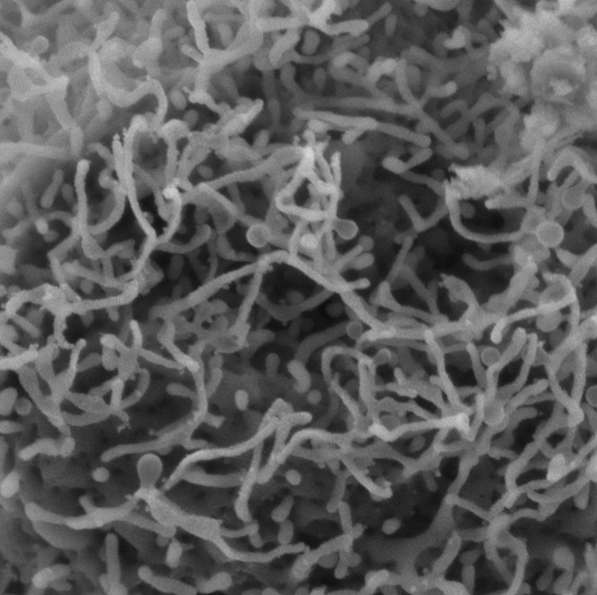
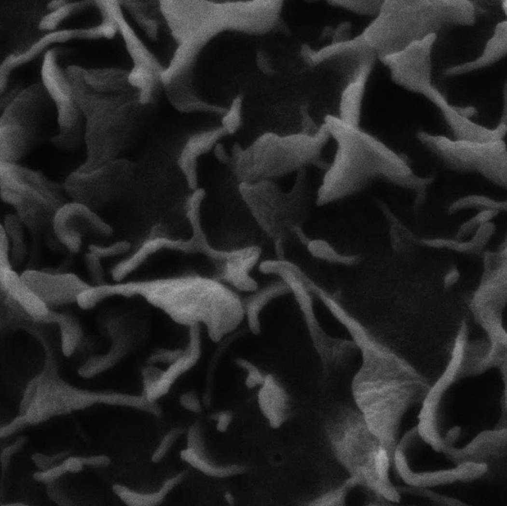

## Behind Density Lines: Machine Learning and Citizen Scientists in Quantifying Scanning Electron Microscopy Images

## [Project Page](https://vtul-cdrs.github.io/QuantSEMAI/)

[Monét Roberts](https://beam.vt.edu/people/faculty/roberts.html), [Yinlin Chen](https://lib.vt.edu/center-for-digital-research-and-scholarship/people/our-team/yinlin-chen.html), [Tanner Upthegrove](https://icat.vt.edu/about/tanner-upthegrove.html). 

Amid the pandemic, screen interactions have surged by 60-80%, accentuating digital eye strain, attention deficits, and posture issues. This study addresses a key challenge in image analysis post-acquisition, especially in scanning electron microscopy (SEM) critical for health and material sciences applications. For instance, surface morphologies in cancer research and fiber quantification in biomaterials demand precise analysis, often hindered by time constraints and human error. This project proposes a machine learning workflow to accurately quantify SEM images, leveraging previously quantified SEM images to create a high-quality training dataset. Concurrently, a community engagement pipeline is devised to involve citizen scientists in SEM analysis, beginning with a pilot study and extending to interactive sessions at the Virginia Tech Science Festival. This dual approach aims to bolster SEM analysis accuracy and foster a reciprocal educational ecosystem, setting a strong foundation for future machine learning applications and community-driven scientific explorations.

  
  

